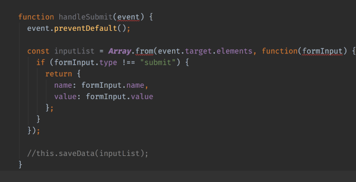

# Chapter 11. Code documentation with JSDoc and first steps with TypeScript (teaser)

### In this chapter:
- an introduction to JSDoc
- first steps with TypeScript

## Laying down the foundations

To be fair learning TypeScript is not something a beginner would or should do. At first sight TypeScript seems a complete different language compared to JavaScript and learning it is a trial and error process. While finishing this book I was also training a team on TypeScript and there were two JavaScript "beginners" in the group. They were programming since a year and an half and they happened to get hooked by TypeScript so much that they decided to learn it full time. And the story repeats almost every time: the more I talk to "fresh" JavaScript developers, the more they want to learn TypeScript too. TypeScript is growing fast and a big percentage of JavaScript jobs today require TypeScript knowledge. But to understand why TypeScript is important in the JavaScript ecosystem we'll take the usual way, as we did in the previous chapters: learn by doing. In the preceding chapter, "Chapter 10. HTML forms and playing with localStorage", we built a simple HTML form alongside with the logic for persisting data to localStorage. In this chapter instead we'll expand the HTML form, and more important we'll work with TypeScript.

## Getting started with TypeScript

What is TypeScript? If you're a beginner the definition from the official website won't help: "TypeScript is a typed superset of JavaScript" but it assumes you know what a "superset" is and what "typed" means. Instead you can think of TypeScript as of "a layer on top" of JavaScript. As you'll see later, TypeScript code is stripped down during the compilation phase. In chapter 3 we saw that JavaScript itself is an interpreted language, but at the same time it's also compiled. Compilation happens microseconds before execution. However, JavaScript engines do not understand TypeScript as it is, so any TypeScript file should go under a "pre-translation" process called compilation as well. Here's the flow: you write TypeScript -> you compile TypeScript -> the TypeScript compiler outputs JavaScript -> you run JavaScript in the browser (or in Node.js). Now your question might be "who compiles TypeScript"? TypeScript has a binary for compiling itself to JavaScript code. We'll start off there. To install the binary you'll need to initialize a JavaScript project in a new folder of choice (I called mine "little-typescript"):

```bash
mkdir little-typescript && cd $_
```

After moving inside the new folder you'll be able to create the project:

```bash
npm init -y
```

Next up install TypeScript with:

```bash
npm i typescript --save-dev
```

The command will install the TypeScript binary in `little-typescript/node_modules/typescript/bin/tsc`. tsc stands for TypeScript compiler and whenever the compiler runs it will look for a file named `tsconfig.json` in the project folder. To generate the configuration file run:

```shell script
node_modules/typescript/bin/tsc --init
```

If everything goes well you'll get "message TS6071: Successfully created a tsconfig.json file." and you'll see the new file in the project folder. To run the TypeScript compiler easily you can also configure an npm script called "tsc" in `package.json`:

```json
{
  "name": "little-typescript",
  "version": "1.0.0",
  "description": "",
  "main": "index.js",
  "scripts": {
    "tsc": "tsc"
  },
  "devDependencies": {
    "typescript": "^3.6.3"
  }
}

```

Now let's take a look at `tsconfig.json`. If you open the file you'll see a lot of configuration options. Remove everything there and replace the configuration with the following lines:

```json
{
  "compilerOptions": {
    "target": "es5",
    "strict": true
  }
}
```

With those two options we're saying to TypeScript to emit compatible ECMAScript 2009 (ES5) and to apply the maximum level of strictness to our code. Later you'll see what it means exactly. Save and close the file for now. To dive into TypeScript we'll rebuild the `Form` class from chapter 10, tackling a method at a time instead of the entire class. Only at the end we'll assemble everything again into `Form`. To start off create a file named **form.html** in your project folder and copy over the following HTML:

```html
<!DOCTYPE html>
<html lang="en">
<head>
    <meta charset="UTF-8">
    <title>HTML forms and JavaScript</title>
</head>
<body>
<h1>What's next?</h1>
<form>
    <label for="name">Name</label>
    <input type="text" id="name" name="name" required minlength="5">

    <label for="description">Short description</label>
    <input type="text" id="description" name="description" required minlength="5">

    <label for="task">Task</label>
    <textarea id="task" name="task" required minlength="10"></textarea>

    <button type="submit">Submit</button>
</form>
</body>
<script src="form.js"></script>
</html>
```

It's the same form from chapter 10. Next up create another file, named **form.ts** in the project folder. This is your first step with TypeScript: every TypeScript file must have the `.ts` extension. The role of the `.ts` extension is twofold:

- it says to your code editor (or IDE) to check "types" in your code
- by default the compiler will ingest all `.ts` files

In **form.ts** we'll copy just one function for now, the `handleSubmit` method from chapter 10. Just make sure to add `function` before the method name since we're not in the class body anymore, and feel free to comment any reference to `this.saveData`:

```typescript
// the method handleSubmit from Form (chapter 10)
// plus the function keyword and a comment before this.saveData

function handleSubmit(event) {
  event.preventDefault();

  const inputList = Array.from(event.target.elements, function(formInput) {
    if (formInput.type !== "submit") {
      return {
        name: formInput.name,
        value: formInput.value
      };
    }
  });

  //this.saveData(inputList);
}
```

The moment after you'll copy that method in **form.ts** everything will fall into pieces. To understand why take a look at the following picture:



My IDE is Webstorm, but if you use Vscode or an equivalent you should see more or less the same red lines. Those lines come from the IDE which recognized a `tsconfig.json` in the project folder and started to check my TypeScript code. To see what the errors are about hover your mouse over them or run the TypeScript compiler with:

```shell script
npm run tsc
```

That will give you the following warnings:

```text
form.ts:1:23 - error TS7006: Parameter 'event' implicitly has an 'any' type.

1 function handleSubmit(event) {
                        ~~~~~

form.ts:4:27 - error TS2339: Property 'from' does not exist on type 'ArrayConstructor'.

4   const inputList = Array.from(event.target.elements, function(formInput) {
                            ~~~~

form.ts:4:64 - error TS7006: Parameter 'formInput' implicitly has an 'any' type.

4   const inputList = Array.from(event.target.elements, function(formInput) {
                                                                 ~~~~~~~~~
```

Cool. Let's tackle them down, one after another. What is "any" first of all? By now you should've got an hint of what TypeScript does. Everything orbits around types. But didn't JavaScript had types already? JavaScript indeed has types as seen in chapter 7:

- String
- Number
- Boolean
- Null
- Undefined
- Object
- Symbol

We can use JavaScript types in our code, like like strings and numbers:

```javascript
var name = "Hello John";
var age = 33;
```

But the "problem" with JavaScript is that a variable can change its type whenever we developers want. A boolean for example can become a string later in the code:

```javascript
var aBoolean = false;
console.log(typeof aBoolean); // "boolean"

aBoolean = "Tom";
console.log(typeof aBoolean); // "string"
```

A developer might really want to assign "Tom" to aBoolean, in that regard the "conversion" is intentional, but there are high chances that these kind of errors will happen by accident. Technically speaking there's nothing wrong with JavaScript itself because its "type dynamism" is designed into the language. After all JavaScript was born as a simple scripting language for the web. However JavaScript relaxed nature can pose serious problems in your code, undermining its maintainability and reliability. TypeScript aims to solve these problems by adding strong types to JavaScript. The "any" type seen in the warnings is an exception, it's a "loose" TypeScript type. It means: this variable might be of any type: string, boolean, object. I don't care. Which in fact is like having no type checking at all. With strict set to true in the configuration you say to TypeScript "don't allow ambiguity in my code":

```json
{
  "compilerOptions": {
    "target": "es5",
    "strict": true
  }
}
```

That's why we got `Parameter 'event' implicitly has an 'any' type.` during compilation. So enough with theory, let's fix those types now.

## Digging deeper into TypeScript types

The complete chapter is available in the [paid version](https://leanpub.com/little-javascript/).
