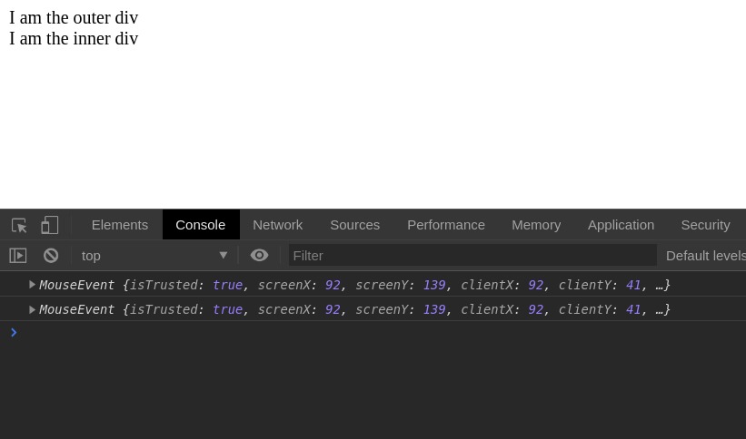

# Chapter 8. Manipulating HTML elements with JavaScript

## The Document Object Model

JavaScript is not that bad. As a scripting language running in the browser it is really useful for manipulating web pages. In this chapter we'll see what function we have for interacting and modifying an HTML document and its elements. But first let's demystify the Document Object Model.

The Document Object Model is a fundamental concept at the base of everything we do inside the browser. But what exactly is that? When we visit a web page the browser figures out how to interpret every HTML element. So that it creates a virtual representation of the HTML document, saved in memory. The HTML page is converted to a tree-like structure and every HTML element becomes a leaf, connected to a parent branch. Consider this simple HTML page:

```html
<!DOCTYPE html>
<html lang="en">
<head>
    <title>A super simple title!</title>
</head>
<body>
<h1>A super simple web page!</h1>
</body>
</html>
```

When the browser scans through the HTML above it creates a Document Object Model which is a mirror of our HTML structure. At the top of this structure there is `document` also called root element, which contains another element: `html`. The `html` element contains an `head` which in turn has a `title`. Then we have `body` containing an `h1`. Every HTML element is represented by a specific type (also called interface) and may contains text or other nested elements:

```ascii
document (HTMLDocument)
  |
  | --> html (HTMLHtmlElement)
          |  
          | --> head (HtmlHeadElement)
          |       |
          |       | --> title (HtmlTitleElement)
          |                | --> text: "A super simple title!"
          |
          | --> body (HtmlBodyElement)
          |       |
          |       | --> h1 (HTMLHeadingElement)
          |              | --> text: "A super simple web page!"
```

Every HTML element descends from [Element](https://developer.mozilla.org/en-US/docs/Web/API/Element) but a large part of them specializes further. You can inspect the prototype for finding out to what "species" an element belongs to. The h1 element for example is an `HTMLHeadingElement`:

```js
document.querySelector('h1').__proto__

// Output: HTMLHeadingElement
```

`HTMLHeadingElement` in turn is a "descendant" of `HTMLElement`:

```js
document.querySelector('h1').__proto__.__proto__

// Output: HTMLElement
```

At this point (especially for beginners) there could be some confusion between `document` and `window`. Well, `window` refers to the browser while `document` on the other hand is the current HTML page. `window` is a global object, directly accessible from any JavaScript code running in the browser. It is not a JavaScript "native" object but rather exposed by the browser itself. `window` has a lot of properties and methods, here are some:

```js
window.alert('Hello world'); // Shows an alert
window.setTimeout(callback, 3000); // Delays execution
window.fetch(someUrl); // makes XHR requests
window.open(); // Opens a new tab
window.location; // Browser location
window.history; // Browser history
window.navigator; // The actual device
window.document; // The current page
```

It's also possible to omit `window` since these properties are global:

```js
alert('Hello world'); // Shows an alert
setTimeout(callback, 3000); // Delays execution
fetch(someUrl); // makes XHR requests
open(); // Opens a new tab
location; // Browser location
history; // Browser history
navigator; // The actual device
document; // The current page
```

You should already be familiar with some of these methods like `setTimeout()` (chapter 3) or `window.navigator`, useful when you want to sniff the language of your users:

```js
if (window.navigator) {
  var lang = window.navigator.language;
  if (lang === "en-US") {
    // show something
  }

  if (lang === "it-IT") {
    // show something else
  }
}
```

There are a lot more methods on `window` and covering them all would be impossible. For learning more make sure to check out [MDN Docs](https://developer.mozilla.org/en-US/docs/Web/API#Interfaces). In the next sections we'll dig deeper into the DOM.

## Nodes, elements, and DOM manipulation

The `document` interface has a number of utilities, like `querySelector()`, a method for selecting any HTML element inside the current HTML page:

```js
document.querySelector('h1');
```

`window` represents the current window's browser and the following instruction is the same as above: 

```js
window.document.querySelector('h1');
```

Anyhow the following syntax is more common and we'll use it a lot in the next sections:

```js
document.methodName();
```

Other than `querySelector()` for selecting HTML elements we have a lot more useful methods:

```js
// returns a single element
document.getElementById('testimonials'); 

// returns an HTMLCollection
document.getElementsByTagName('p'); 

// returns a NodeList
document.querySelectorAll('p');
```

Not only you can select HTML elements, one can also interact and modify their inner state. For example you may want to read or change the inner content of a given element:

```js
// Read or write
document.querySelector('h1').innerHtml; // Read
document.querySelector('h1').innerHtml = ''; // Write! Ouch!
```

Every HTML element of the DOM is also a "Node", in fact we can inspect the node type like so:

```js
document.querySelector('h1').nodeType;
```

The example returns `1` which is the identifier for nodes of type Element. You can also inspect the node name:
 
```js
document.querySelector('h1').nodeName;

"H1"
```

Here the node name is returned in uppercase. Usually we deal with four types of node in the DOM:

- document: the root node (nodeType 9)
- nodes of type Element: the actual HTML tags (nodeType 1)
- node of type attribute: the properties (attributes) of every HTML element
- nodes of type Text: the actual text content of an element (nodeType 3)

Since elements are node and nodes can have properties (also called attributes) JavaScript developers can inspect and manipulate said properties:

```js
// Returns true or false
document.querySelector('a').hasAttribute('href');

// Returns the attribute text content, or null
document.querySelector('a').getAttribute('href');

// Sets the given attribute
document.querySelector('a').setAttribute('href', 'someLink');
```

Earlier we said that the DOM is a tree-like structure. This trait reflects on HTML elements too. Every element may have parents and children and we can look at them by inspecting certain properties of the element:

```js
// Returns an HTMLCollection
document.chidren;

// Returns a NodeList
document.chidNodes;

// Returns a Node
document.querySelector('a').parentNode;

// Returns an HTML element
document.querySelector('a').parentElement;
```

We saw how to select and query HTML elements. How about making some? For creating new nodes of type Element the native DOM API offers the `createElement` method which you'll call like so:

```js
var heading = document.createElement('h1');
```

And for creating text we use `createTextNode`:

```js
var text = document.createTextNode('Hello world');
```

The two nodes can be combined together by appending the text inside a new HTML element. Last but not least we can also append the heading element to the root document:

```js
var heading = document.createElement('h1');
var text = document.createTextNode('Hello world');
heading.appendChild(text);
document.body.appendChild(heading);
```

Nodes can also be removed from the Document Object Model with the `remove()` method. Call the method on an element and the node will disappear from the page:

```js
document.querySelector('h1').remove();
```

Believe it or not that's all you need to know for start working with JavaScript in the browser. In nerd circles we refer to these instructions as DOM manipulation. In the next section we'll make the DOM to good use but first a quick detour because we need to talk about "DOM events".

## DOM and events

DOM elements are smart. They can not only contain text and other HTML elements but also "emit" and react to "events" as well. Head over any web site and open up the browser console. Select an element with:

```js
document.querySelector('p')
```

and check out this property:

```js
document.querySelector('p').onclick
```

What type of entity is it?

```js
typeof document.querySelector('p').onclick // "object"
```

"object"! And why on earth it's called "onclick"? With a bit of intuition we can imagine that it's some magic property on the element, able to react to clicks? Exactly. You can explore the prototype chain of any HTML element if you're curious. You'll find out that every element is also an Element, which in turn is a Node, which in turn is also an [EventTarget](https://developer.mozilla.org/en-US/docs/Web/API/EventTarget). You can confirm with a simple check:

```js
document.querySelector('p') instanceof EventTarget // true
``` 

I would love to call EventTarget the father of all HTML elements but in JavaScript there is not real inheritance (see chapter 5). It's more like any HTML element can see the properties of another connected object. So any HTML element shares the same traits with EventTarget: the ability to emit events. But what are events really? Take an HTML button for example. If you click on it, that's an event. And with that little `.onclick` object we can register JavaScript functions that'll run as soon as the element is clicked. A function passed to an event is known as the "event listener" or the "event handler". 

### Events and listeners

There are three ways for registering event listeners in the DOM. The first form is archaic and should be avoided because it mixes logic and markup:

```html
<!-- BAD -->
<button onclick="console.log('clicked')">CLICK ME</button>
```

The second option relies on an object named after the event. For example we can listen to the click event by registering a function on the object `.onclick`:

```js
document.querySelector("button").onclick = handleClick;

function handleClick() {
  console.log("Clicked!");
}
```

This syntax is more cleaner and is a good alternative to the inline handler. There is also a third, and more modern form based on `addEventListener`:

```js
document.querySelector("button").addEventListener("click", handleClick);

function handleClick() {
  console.log("Clicked!");
}
```

Personally I like this form more but if you strive for maximum browser compatibility stick with `.on`. And now that we've got an HTML element and an event listener let's explore DOM events a bit more.

### The event object, event default and event bubbling

Every function passed as an event handler receives by default an object named "event":

```js
var button = document.querySelector("button");
button.addEventListener("click", handleClick);

function handleClick() {
  console.log(event);
}
```

It's available straight in the body of the function but in my code I prefer to declare it explicitly as a parameter:

```js
function handleClick(event) {
  console.log(event);
}
```

The event object is a "must have" because we can control the event's behaviour by calling some methods on it. Events in fact have specific traits, notably the "default" and the "bubbling". Consider an HTML link. Create a new HTML file named **click-event.html** with the following markup:

```html
<!DOCTYPE html>
<html lang="en">
<head>
    <meta charset="UTF-8">
    <title>Click event</title>
</head>
<body>
<div>
    <a href="/404.html">click me!</a>
</div>
</body>
<script src="click-event.js"></script>
</html>
```

Run the file in a browser and try to click the link. It will result in a 404. The default behavior for click events on links is (not surprisingly) going to the actual page specified in the href attribute. But what if I tell you there's a way to block the default? Enter `preventDefault()`, a method available on the event object. Create a new file named **click-event.js** with the following code:

```js
var button = document.querySelector("a");
button.addEventListener("click", handleClick);

function handleClick(event) {
  event.preventDefault();
}
```

Refresh the page in the browser and try to click the link now: it won't take you out of the page. You just discovered "event default"! Links are not the only HTML element subject to a default action. Forms have the same feature. In chapter 11 you'll have the chance to explore the default behaviour for them. There's also another interesting trait that manifests itself when an HTML element is nested inside another. Consider the following HTML:

```html
<!DOCTYPE html>
<html lang="en">
<head>
    <meta charset="UTF-8">
    <title>Nested events</title>
</head>
<body>
<div id="outer">
    I am the outer div
    <div id="inner">
        I am the inner div
    </div>
</div>
</body>
<script src="nested-events.js"></script>
</html>
```

and the following JavaScript code:

```js
// nested-events.js

var outer = document.getElementById('inner');
var inner = document.getElementById('outer');

function handleClick(event){
    console.log(event);
}

inner.addEventListener('click', handleClick);
outer.addEventListener('click', handleClick);
```

There are two event listeners, one for the outer div and one for the inner div. I suggest you try the HTML page in a browser, with the console opened. Click exactly on the inner div. What do you see?



Two events printed! That's event bubbling in action. It looks like a bug in how browsers behave and there is a way to disable bubbling with `stopPropagation()`, again, called on the event object:

```js
//
function handleClick(event) {
  event.stopPropagation();
  console.log(event);
}
///
```

Despite looking like a poor implementation event bubbling shines in situations where registering too many event listeners would be really bad for performances. Consider the following example:

```html
<!DOCTYPE html>
<html lang="en">
<head>
    <meta charset="UTF-8">
    <title>Event bubbling</title>
</head>
<body>
<ul>
    <li>one</li>
    <li>two</li>
    <li>three</li>
    <li>four</li>
    <li>five</li>
</ul>
</body>
<script src="event-bubbling.js"></script>
</html>
```

How many event listeners would you register on that list? The answer is: one. It takes just one listener registered on `ul` for intercepting all the clicks on any `li`:

```js
// event-bubbling.js

var ul = document.getElementsByTagName("ul")[0];

function handleClick(event) {
  console.log(event);
}

ul.addEventListener("click", handleClick);
```

As you can see event bubbling is a practical way for improving performance. Registering an event listener in fact is an expensive operation for the browser and in case of massive lists of elements you may incur in a performance penalty. The more you know ...

## Generating HTML tables with JavaScript

HTML is a static markup language. After defining some HTML elements there is no way to modify them (besides using CSS). JavaScript will become our friend here and you'll do a simple exercise for refreshing your JavaScript skills. You may wonder "why should I use pure JavaScript and not jQuery?". Well, be aware that jQuery is fading away. Bootstrap 5 will remove it from the dependencies and many more are dropping it as well. There is a valid reason behind this: the native DOM API is complete and mature enough to make  [jQuery obsolete](http://youmightnotneedjquery.com/).

Now let's begin coding. Given an array of objects we want to dynamically generate an HTML table. An HTML table is represented by a `<table>` element. Every table can have an header as well, defined by a `<thead>` element. The header can have one or more rows, `<tr>`, and every header's row has a cell, represented by a `<th>` element. Like so:

```html
<table>
    <thead>
    <tr>
        <th>name</th>
        <th>height</th>
        <th>place</th>
    </tr>
    </thead>
    <!-- more stuff here! -->
</table>
```

But there's more. Every table has a body most of the time, defined by `<tbody>` which in turn contains a bunch of rows, `<tr>`. Every row can have cells containing the actual data. Table cells are defined by `<td>`. Here's how a complete table looks like:


```html
<table>
    <thead>
    <tr>
        <th>name</th>
        <th>height</th>
        <th>place</th>
    </tr>
    </thead>
    <tbody>
    <tr>
        <td>Monte Falco</td>
        <td>1658</td>
        <td>Parco Foreste Casentinesi</td>
    </tr>
    <tr>
        <td>Monte Falterona</td>
        <td>1654</td>
        <td>Parco Foreste Casentinesi</td>
    </tr>
    </tbody>
</table>
```

Our task now is to generate the table starting from an array of JavaScript objects. To start off create a new file named **build-table.html** and save it in a folder of choice:

```html
<!DOCTYPE html>
<html lang="en">
<head>
    <meta charset="UTF-8">
    <title>Build a table</title>
</head>
<body>
<table>
<!-- here goes our data! -->
</table>
</body>
<script src="build-table.js"></script>
</html>
```

Create another file named **build-table.js** in the same folder and start the code with the following array (remember, `"use strict"` should appear at the top of every new JavaScript file you write):

```javascript
"use strict";

var mountains = [
  { name: "Monte Falco", height: 1658, place: "Parco Foreste Casentinesi" },
  { name: "Monte Falterona", height: 1654, place: "Parco Foreste Casentinesi" },
  { name: "Poggio Scali", height: 1520, place: "Parco Foreste Casentinesi" },
  { name: "Pratomagno", height: 1592, place: "Parco Foreste Casentinesi" },
  { name: "Monte Amiata", height: 1738, place: "Siena" }
];
```

Now let's think about the table. First thing first we need a `<thead>`. You might be tempted to use `createElement`:

```js
document.createElement('thead')
```

It's not wrong but a closer look at the [MDN documentation for table](https://developer.mozilla.org/en-US/docs/Web/HTML/Element/table) reveals an intriguing detail. `<table>` is an [HTMLTableElement](https://developer.mozilla.org/en-US/docs/Web/API/HTMLTableElement), an interface containing some interesting methods. One of the most useful is `HTMLTableElement.createTHead()` which can help in creating our `<thead>`.

So let's start with a first JavaScript function called generateTableHead:

```javascript
function generateTableHead(table) {
  var thead = table.createTHead();
}
```

Our function takes a selector and creates a `<thead>` on the given table:

```javascript
function generateTableHead(table) {
  var thead = table.createTHead();
}

var table = document.querySelector("table");

generateTableHead(table);
```

Open **build-table.html** in a browser: there's nothing! But if you open up the browser console you can see a new `<thead>` attached to the table. Time to populate the header! First we have to create a row inside it. There is another method that can help: `HTMLTableElement.insertRow()`. With this info we can extend our function:

```javascript
function generateTableHead(table) {
  var thead = table.createTHead();
  var row = thead.insertRow();
}
```

At this point we can generate our rows. By looking at the source array we can see that any object in it has the info we're looking for: name, height, place:

```js
var mountains = [
  { name: "Monte Falco", height: 1658, place: "Parco Foreste Casentinesi" },
  { name: "Monte Falterona", height: 1654, place: "Parco Foreste Casentinesi" },
  { name: "Poggio Scali", height: 1520, place: "Parco Foreste Casentinesi" },
  { name: "Pratomagno", height: 1592, place: "Parco Foreste Casentinesi" },
  { name: "Monte Amiata", height: 1738, place: "Siena" }
];
```

That means we can pass another parameter to our function: an array to iterate over for generating header cells:

```js
function generateTableHead(table, data) {
  var thead = table.createTHead();
  var row = thead.insertRow();
  for (var i = 0; i < data.length; i++) {
    var th = document.createElement("th");
    var text = document.createTextNode(data[i]);
    th.appendChild(text);
    row.appendChild(th);
  }
}
```

Unfortunately there is no native method for creating header cells so I'll resort to `document.createElement("th")`. Also worth noting `document.createTextNode(data[i])` for creating text nodes and `appendChild()` for appending our new elements to every tag. When creating and manipulating elements this way we talk of "imperative" DOM manipulation. Modern front-end libraries are tackling this problem by favoring a "declarative" approach. Instead of commanding the browser step by step we can declare what HTML elements do we need and the library takes care of the rest.

Back to our code we can use our first function like so:

```js
var table = document.querySelector("table");
var data = Object.keys(mountains[0]);
generateTableHead(table, data);
```

Now we can move further to generating the actual table's data. Our next function will implement a logic similar to generateTableHead but this time we need two nested for loops. In the innermost loop we'll exploit another native method for creating a series of `td`. The method is `HTMLTableRowElement.insertCell()`. Add another function named generateTable in the same file we created earlier:


```javascript
function generateTable(table, data) {
  for (var i = 0; i < data.length; i++) {
    var row = table.insertRow();
    for (var key in data[i]) {
      var cell = row.insertCell();
      var text = document.createTextNode(data[i][key]);
      cell.appendChild(text);
    }
  }
}
```

The above function is called passing an HTML table and an array of objects as arguments:

```js
generateTable(table, mountains);
```

Let's dig a bit into the logic for `generateTable`. The parameter `data` is an array corresponding to `mountains`. The outermost `for` loop cycles through the array and creates a row for every element:

```js
function generateTable(table, data) {
  for (var i = 0; i < data.length; i++) {
    var row = table.insertRow();
    // omitted for brevity
  }
}
```

The innermost loop cycles through every key of any given object and for every object creates a text node containing the key's value:

```js
function generateTable(table, data) {
  for (var i = 0; i < data.length; i++) {
    var row = table.insertRow();
    for (var key in data[i]) {
      // inner loop
      var cell = row.insertCell();
      var text = document.createTextNode(data[i][key]);
      cell.appendChild(text);
    }
  }
}
```

If you followed every step you should end up with the following code:

```js
var mountains = [
  { name: "Monte Falco", height: 1658, place: "Parco Foreste Casentinesi" },
  { name: "Monte Falterona", height: 1654, place: "Parco Foreste Casentinesi" },
  { name: "Poggio Scali", height: 1520, place: "Parco Foreste Casentinesi" },
  { name: "Pratomagno", height: 1592, place: "Parco Foreste Casentinesi" },
  { name: "Monte Amiata", height: 1738, place: "Siena" }
];

function generateTableHead(table, data) {
  var thead = table.createTHead();
  var row = thead.insertRow();
  for (var i = 0; i < data.length; i++) {
    var th = document.createElement("th");
    var text = document.createTextNode(data[i]);
    th.appendChild(text);
    row.appendChild(th);
  }
}

function generateTable(table, data) {
  for (var i = 0; i < data.length; i++) {
    var row = table.insertRow();
    for (var key in data[i]) {
      var cell = row.insertCell();
      var text = document.createTextNode(data[i][key]);
      cell.appendChild(text);
    }
  }
}
```

Which called with:

```js
var table = document.querySelector("table");
var data = Object.keys(mountains[0]);
generateTable(table, mountains);
generateTableHead(table, data);
```

will produce our table!


I know what you're thinking. The code we wrote so far can be improved. Hold tight, in the next chapter we'll refactor to a JavaScript module.

## Conclusions

The Document Object Model is a virtual copy of the web page kept in memory by web browsers. DOM Manipulation is the act of creating, modifying and removing HTML elements from the DOM. In the past we used to rely on jQuery even for simpler tasks but today the native API is mature enough to make jQuery obsolete. On the other hand jQuery won't disappear anytime soon but every JavaScript developer must know how to manipulate the DOM with the native API. There are many reasons to do so. Additional libraries increase load time and size of JavaScript applications. Not to mention that DOM manipulation come up a lot in technical interviews. Every HTML element available in the DOM has an interface exposing a certain number of properties and methods. When in doubt about what method to use head over the excellent docs at [MDN](https://developer.mozilla.org/en-US/). Most common methods for manipulating the DOM are `document.createElement()` for creating a new HTML element, `document.createTextNode()` for creating text nodes inside the DOM. Last but not least there is `.appendChild()` for appending new HTML elements or a text node to an existing element. HTML elements have also the ability to emit events, also called DOM events. Most notable events are "click", "submit", "drag", "drop", and more. DOM events have some peculiar behaviour like the "default" and the bubbling. JavaScript developers can take advantage of these properties, which, especially for event bubbling, are useful for speeding up event handling in the DOM. While it is nice to have a good knowledge of the native API these days modern front-end libraries offer unquestionable benefits. It is indeed feasible to build a large JavaScript application with "vanilla" JavaScript yet Angular, React, and Vue can help a lot.

### Sharpen up your JavaScript skills

**More quizzes available in the [paid version](https://leanpub.com/little-javascript/)**.

- What is the difference between `window` and DOM?
- Name at least 3 useful methods for manipulating tables with JavaScript
- Given a JavaScript object how can I extract every key from it?